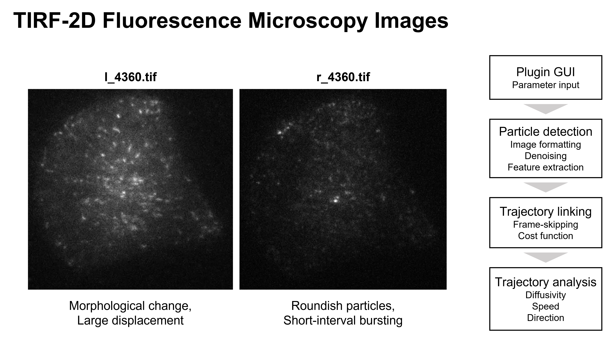

# Bioimage Informatics 2023

## Basic Information

The code is mainly used for BII2023 homeworks and group project. Please refer to [BII2023](https://edu.epfl.ch/coursebook/fr/bioimage-informatics-BIO-410) for more details.

This is an example Maven project implementing an ImageJ command with a Pom adapted for BioImageIformatics at EPFL. It was initially cloned from https://github.com/BIOP/ijp-template-ij2 (14th September 2022). The basic programming framework was kept. 

New codes were included for resolving bioimaging tasks (i.e., multidimensional data pixel-wise operation, segmentation...) presented in lectures.

## TIRF Protein Tracking (Mini-project)

**Code avaiable [here](./src/main/java/ch/epfl/bii/ij2command/TirfTracking/).**

Total internal reflection fluorescence (TIRF) microscopy is an advance technique for quantifying fluorescence signal in a hundred-nanometer thin axial section. In the context of particle tracking, it provides high contrast images of how particles diffuse, interact, and traffic within the plane. 

Together with **Kuzey Aydin** and **Chang Liu**, we built a particle tracking workflow for TIRF microscopy images. Specifically, I focused on the development of particle detection and trajectory linking, and my teammates worked on trajectory analysis.

### Detection

We can see from the raw data that particles feature diverse moving patterns. In some samples, particles are trafficking for a long distance, while in others, particles burst locally within a short time interval. To generalize the workflow, I included both local max and binarization-based methods. If particles remain roundish and show a sharp intensity burst, the local max filter would be applied; whereas if particles elogate and show an ambiguous intensity profile, the thresholding binerization would be carried out. Two methods share common preprocessing steps (exponential correction, DoG, gaussian 3D, tophat).

### Trajectory linking

I designed a cost function for forming correct linking that represents particle trajectories. In addition to the distance term and the intensity term, I added the orientation term $O_{t+s}$. The orientation term is the result of convolution by a time filter $(0,0,0,0,0,0,3,3,4,4,5)$ (inverted). It plays as an indicator of future, giving a clue of which direction the particle is moving towards. A lower $O_{t+s}$ implies a higher chance that the particle locates at the position after few frames. In addition, we implement linking not only between frame $t$ and $t+1$. Frame skipping is possible as $s=1,2,3,4,5$.

$$ c(x_t, x_{t+s}) = (1-\lambda-\gamma)\frac{d(x_t, x_t+s)}{d_{\text{max}}}+\lambda\frac{|f(x_t)-f(x_{t+s})|}{f_{\text{max}}}+\gamma\frac{O(x_{t+s})}{O_{\text{max}}} $$

Furthermore, I also set a upper limit for linkage formation. Due to the fact that it's impossible for particles to have a long displacement within a short time interval, this constraint discontinues trajectories correctly and avoids false connections.

## Other Available Plugins (Assignments)

### 1. Bleaching Correction

**Code avaiable [here](./src/main/java/ch/epfl/bii/ij2command/BleachingCorrection.java).**

The fluorescence intensity of a life-imaging sample may decay exponentially as time goes because of photobleaching. The bleaching process can be represented as 

$$I(t) = A*\exp{(t/\tau)}+C$$ 

Given an image stack, this plugin fits the parameters $A$, $\tau$ and $C$. It would perform a pixel-wise computation to make the mean of each frame in a comparable level to compensate such gradual drop. A certain level of noise can be observed in later time frames due to higher SNR.

### 2. Multiple Channels Quantification

**Code avaiable [here](./src/main/java/ch/epfl/bii/ij2command/MultipleChannelsQuantification.java).**

The plugin computes the gene expression (in form of fluorescence) of the cytoplasm at the very close periphery of every nucleus in a sequence of images. The input should includes two stacks, one for nucleus and the other for cytoplasm. The plugin first generates a mask of nucleus and then overlays ROIs onto the cytoplasm image. The measured values would be plotted into a time vs. intensity scatter plot.

### 3. Particle Tracking

**Code avaiable [here](./src/main/java/ch/epfl/bii/ij2command/ParticleTracking).**

Spots in a sequence of images are tracked and trajectories are plotted. The workflow can be divided into two parts: spot detection and association. Detection is done with a DoG filter followed by local max filtering. Association is done by evaluating the cost function 

$$ c(x_t, x_{t+1}) = (1-\lambda)\frac{d(x_t, x_t+1)}{d_{\text{max}}}+\lambda\frac{|f(x_t)-f(x_{t+1})|}{f_{\text{max}}} $$

where $d$ is the distance between two spots, $f$ is the intensity of the spot, and $\lambda$ is a parameter to balance the two terms. In addition, potential division of particles is considered and assigned with the same color during visualization.

